# Project Hub — Plataforma de Gestion de Proyectos con IA

> Plataforma empresarial de gestion agil con **Inteligencia Artificial integrada (ARIA)**, **Google Drive nativo**, **Bridge MCP** para agentes externos y un **sistema multi-tenant** por organizaciones — todo construido como un **monorepo full-stack TypeScript**.


---

## Tabla de Contenidos

**Bloque 1 — Vision y Arquitectura**
- [1. Vision General](#1-vision-general)
- [2. Arquitectura Multi-Tenant](#2-arquitectura-multi-tenant)
- [3. Arquitectura Multi-Supabase](#3-arquitectura-multi-supabase)

**Bloque 2 — Requisitos**
- [4. Requisitos Funcionales](#4-requisitos-funcionales)
- [5. Requisitos No Funcionales](#5-requisitos-no-funcionales)
- [6. Reglas de Negocio](#6-reglas-de-negocio)

**Bloque 3 — Modelado**
- [7. Historias de Usuario](#7-historias-de-usuario)
- [8. Casos de Uso](#8-casos-de-uso)

**Bloque 4 — Diagramas**
- [9. Diagramas de Arquitectura](#9-diagramas-de-arquitectura)
- [10. Diagramas de Estado](#10-diagramas-de-estado)
- [11. Diagramas de Flujo](#11-diagramas-de-flujo)

**Bloque 5 — Caracteristicas del Sistema**
- [12. Caracteristicas Principales](#12-caracteristicas-principales)
- [13. ARIA: Agente de IA](#13-aria-agente-de-ia)
- [14. Google Drive y Documentos](#14-google-drive-y-documentos)
- [15. Bridge MCP y API Keys](#15-bridge-mcp-y-api-keys)

**Bloque 6 — Datos**
- [16. Diccionario de Datos](#16-diccionario-de-datos)

**Bloque 7 — Pruebas**
- [17. Mapeo de Pruebas](#17-mapeo-de-pruebas)

**Bloque 8 — Tecnico**
- [18. Stack Tecnologico](#18-stack-tecnologico)
- [19. Estructura del Proyecto](#19-estructura-del-proyecto)
- [20. Base de Datos y Migraciones](#20-base-de-datos-y-migraciones)
- [21. Instalacion y Configuracion](#21-instalacion-y-configuracion)
- [22. Variables de Entorno](#22-variables-de-entorno)
- [23. Scripts Disponibles](#23-scripts-disponibles)
- [24. Despliegue](#24-despliegue)
- [25. Documentacion Adicional](#25-documentacion-adicional)

---

# BLOQUE 1 — VISION Y ARQUITECTURA

## 1. Vision General

**Project Hub** es una plataforma centralizada que redefine la colaboracion en equipo, uniendo la gestion de proyectos agiles, analisis de rendimiento, inteligencia artificial reactiva (ARIA), y conexion con herramientas externas como **Google Drive** y **agentes MCP**.

Funciona como un **Dashboard Administrativo** completo que fusiona herramientas de administracion, seguimiento de proyectos y equipos, y un agente de IA embebido en todos los procesos operativos del workspace.

### Modulos Funcionales

| Modulo | Descripcion |
|--------|-------------|
| **Dashboard** | Panel principal con KPIs, actividad reciente y resumen del workspace |
| **Proyectos** | Gestion de proyectos con issues, milestones, ciclos y documentos |
| **Equipos** | Administracion de equipos, miembros, roles y tareas Kanban |
| **Analytics** | Visualizaciones interactivas, heatmaps y metricas de rendimiento |
| **Reportes** | Reportes ejecutivos PDF/CSV con analisis predictivo con IA |
| **Herramientas** | FocusTimer, Agile Advisor, Diagram Generator |
| **Admin Global** | Panel super-admin con gestion cross-workspace |
| **ARIA Chat** | Agente de IA conversacional con function calling |
| **Perfil** | Gestion de perfil, avatar y configuracion personal |
| **Configuracion** | Settings del workspace, notificaciones, API keys |

---

## 2. Arquitectura Multi-Tenant

Project Hub utiliza una arquitectura orientada a la segmentacion mediante **Organizaciones (Tenants)**:

- **Aislamiento logico**: Toda la informacion esta vinculada al `workspace_id` de su organizacion.
- **URLs semanticas por Slug**: Las organizaciones acceden via `/[orgSlug]/dashboard`.
- **Seleccion de organizacion**: Flujo dedicado (`/select-organization`) para usuarios que pertenecen a multiples organizaciones.

### Dos Sistemas de Layout

| Sistema | Ruta | Acceso | Descripcion |
|---------|------|--------|-------------|
| **Admin Global** | `/admin/*` | super_admin, admin | Panel de administracion del sistema |
| **Workspace** | `/[orgSlug]/*` | Todos los roles | Espacio de trabajo por organizacion |
| **Admin Workspace** | `/[orgSlug]/admin/*` | owner, admin | Sub-panel admin dentro del workspace |

---

## 3. Arquitectura Multi-Supabase

Project Hub opera con **4 instancias Supabase** conectadas para separar responsabilidades:

```
SOFIA Supabase (Auth Master)          Project Hub Supabase (Data DB)
  users ──────────────────────────> account_users
  organization_users ─────────────> workspace_members
  organizations ──────────────────> workspaces
                                         |
                                   Content Generator
                                   (Contenido IA)
       |
  LIA Extension
  (Conversaciones)
```

| Instancia | Responsabilidad |
|-----------|----------------|
| **SOFIA** | Autenticacion SSO, usuarios, organizaciones, perfiles (fuente de verdad) |
| **Project Hub** | Datos de negocio: proyectos, tareas, workspaces, documentos, API keys |
| **Content Generator** | Contenido educativo generado por IA |
| **LIA Extension** | Datos de la extension de escritorio (conversaciones, meetings) |

> **Sincronizacion automatica**: Al hacer login via SSO con SOFIA, se sincronizan automaticamente los datos del usuario a Project Hub.

---

# BLOQUE 2 — REQUISITOS

## 4. Requisitos Funcionales

### 4.1 Autenticacion (RF-AUTH)

| ID | Descripcion | Prioridad |
|----|-------------|-----------|
| RF-AUTH-001 | El sistema debe permitir login con email/username y password, priorizando autenticacion SOFIA con fallback local | Alta |
| RF-AUTH-002 | El sistema debe generar tokens JWT (access 1h + refresh 7d) al autenticar exitosamente | Alta |
| RF-AUTH-003 | El sistema debe bloquear la cuenta tras 3 intentos fallidos de login por 30 segundos | Alta |
| RF-AUTH-004 | El sistema debe permitir renovar tokens mediante refresh token valido | Alta |
| RF-AUTH-005 | El sistema debe permitir cerrar sesion revocando tokens activos | Alta |
| RF-AUTH-006 | El sistema debe permitir registro de nuevos usuarios con validacion de datos | Alta |
| RF-AUTH-007 | El sistema debe permitir cambio de contrasena verificando la contrasena actual | Media |
| RF-AUTH-008 | El sistema debe registrar cada intento de login en el historial (auth_login_history) | Media |
| RF-AUTH-009 | El sistema debe sincronizar datos del usuario SOFIA al sistema local en cada login | Alta |

### 4.2 Workspaces (RF-WS)

| ID | Descripcion | Prioridad |
|----|-------------|-----------|
| RF-WS-001 | El sistema debe crear workspaces automaticamente al sincronizar organizaciones desde SOFIA | Alta |
| RF-WS-002 | El sistema debe permitir a usuarios con multiples workspaces seleccionar su workspace al iniciar sesion | Alta |
| RF-WS-003 | El sistema debe sincronizar todos los miembros de una organizacion SOFIA al workspace | Alta |
| RF-WS-004 | El sistema debe permitir a owner/admin editar el iris_role de miembros del workspace | Alta |
| RF-WS-005 | El sistema debe soportar 5 roles: owner, admin, manager, leader, member con permisos diferenciados | Alta |
| RF-WS-006 | El sistema debe permitir configurar preferencias de notificaciones por workspace | Media |
| RF-WS-007 | El sistema debe permitir configurar ajustes generales del workspace (solo owner) | Media |

### 4.3 Equipos (RF-TEAM)

| ID | Descripcion | Prioridad |
|----|-------------|-----------|
| RF-TEAM-001 | El sistema debe permitir CRUD completo de equipos dentro de un workspace | Alta |
| RF-TEAM-002 | El sistema debe crear automaticamente 5 estados de tareas al crear un equipo (Backlog, Todo, In Progress, Done, Cancelled) | Alta |
| RF-TEAM-003 | El sistema debe permitir agregar y remover miembros de un equipo | Alta |
| RF-TEAM-004 | El sistema debe soportar visibilidad de equipo: Private, Internal, Public | Media |
| RF-TEAM-005 | El sistema debe permitir configurar color y descripcion del equipo | Baja |

### 4.4 Proyectos (RF-PROJ)

| ID | Descripcion | Prioridad |
|----|-------------|-----------|
| RF-PROJ-001 | El sistema debe permitir CRUD de proyectos vinculados a un workspace y opcionalmente a un equipo | Alta |
| RF-PROJ-002 | El sistema debe generar automaticamente un project_key unico (ej: DEMO-001) | Alta |
| RF-PROJ-003 | El sistema debe calcular el progreso del proyecto en tiempo real basado en el estado de sus issues | Alta |
| RF-PROJ-004 | El sistema debe soportar estados de proyecto: planning, active, on_hold, completed, cancelled, archived | Alta |
| RF-PROJ-005 | El sistema debe soportar indicadores de salud: on_track, at_risk, off_track | Media |
| RF-PROJ-006 | El sistema debe permitir crear y gestionar milestones por proyecto | Media |
| RF-PROJ-007 | El sistema debe permitir vincular documentos de Google Drive a proyectos | Media |
| RF-PROJ-008 | El sistema debe permitir crear y gestionar actualizaciones/notas del proyecto | Media |
| RF-PROJ-009 | El sistema debe registrar historico de progreso para graficas sparkline | Media |
| RF-PROJ-010 | El sistema debe permitir vistas de proyecto en modo List, Board y Timeline | Media |

### 4.5 Tareas/Issues (RF-TASK)

| ID | Descripcion | Prioridad |
|----|-------------|-----------|
| RF-TASK-001 | El sistema debe permitir CRUD de issues/tareas vinculadas a un equipo | Alta |
| RF-TASK-002 | El sistema debe auto-incrementar el numero de issue por equipo (ej: PULSE-42) | Alta |
| RF-TASK-003 | El sistema debe permitir asignar status, prioridad, asignado, labels, ciclo, fecha limite y puntos de estimacion | Alta |
| RF-TASK-004 | El sistema debe registrar historial de cambios por cada campo modificado (task_issue_history) | Alta |
| RF-TASK-005 | El sistema debe actualizar completed_at automaticamente al mover a estado cerrado | Alta |
| RF-TASK-006 | El sistema debe soportar vistas Kanban (Board) y Lista agrupada por estado | Alta |
| RF-TASK-007 | El sistema debe permitir crear relaciones entre issues: blocks, relates_to, duplicates | Media |
| RF-TASK-008 | El sistema debe permitir comentarios en issues | Media |
| RF-TASK-009 | El sistema debe permitir suscripciones/watchers en issues | Baja |
| RF-TASK-010 | El sistema debe soportar ciclos/sprints con estados: upcoming, current, completed | Alta |
| RF-TASK-011 | El sistema debe permitir soft-delete de issues (archived_at) | Media |
| RF-TASK-012 | El sistema debe permitir vincular documentos de Google Drive a issues | Media |

### 4.6 Inteligencia Artificial (RF-AI)

| ID | Descripcion | Prioridad |
|----|-------------|-----------|
| RF-AI-001 | El sistema debe permitir chat con ARIA (Gemini 2.0 Flash) con contexto del workspace | Alta |
| RF-AI-002 | El sistema debe permitir analizar documentos de Google Drive con IA para generar issues automaticamente | Alta |
| RF-AI-003 | El sistema debe permitir generar recomendaciones de metodologia agil (Agile Advisor) | Media |
| RF-AI-004 | El sistema debe permitir generar diagramas Mermaid automaticamente (Diagram Generator) | Media |
| RF-AI-005 | El sistema debe permitir generar reportes predictivos con IA | Media |
| RF-AI-006 | ARIA debe soportar streaming bidireccional para respuestas en tiempo real | Alta |
| RF-AI-007 | ARIA debe poder ejecutar acciones: create_task, update_task, create_project, manage_team_member | Alta |

### 4.7 Google Drive (RF-GD)

| ID | Descripcion | Prioridad |
|----|-------------|-----------|
| RF-GD-001 | El sistema debe permitir conectar/desconectar cuenta de Google via OAuth 2.0 | Alta |
| RF-GD-002 | El sistema debe almacenar tokens OAuth encriptados con AES-256-GCM | Alta |
| RF-GD-003 | El sistema debe auto-renovar tokens de Google expirados | Alta |
| RF-GD-004 | El sistema debe permitir seleccionar archivos de Drive via Google Picker | Alta |
| RF-GD-005 | El sistema debe permitir preview embebido de Docs, Sheets y Slides | Media |
| RF-GD-006 | El sistema debe permitir subir archivos al Drive del usuario | Media |
| RF-GD-007 | El sistema debe permitir leer contenido de documentos para analisis con IA | Alta |
| RF-GD-008 | El sistema debe parsear URLs de Google Drive para vincular documentos | Media |

### 4.8 Bridge MCP (RF-MCP)

| ID | Descripcion | Prioridad |
|----|-------------|-----------|
| RF-MCP-001 | El sistema debe permitir generar API keys con prefijo `phub_` hasheadas con HMAC-SHA256 | Alta |
| RF-MCP-002 | El sistema debe permitir listar, crear y revocar API keys por workspace | Alta |
| RF-MCP-003 | El sistema debe exponer endpoint GET para obtener contexto completo del workspace | Alta |
| RF-MCP-004 | El sistema debe exponer endpoint POST para ejecutar acciones (create_task, update_task, delete_task, update_project, create_milestone, create_cycle) | Alta |
| RF-MCP-005 | El sistema debe soportar scopes configurables (read, write) por API key | Alta |
| RF-MCP-006 | El sistema debe trackear uso de API keys (last_used_at, total_requests) | Media |

### 4.9 Notificaciones (RF-NOTIF)

| ID | Descripcion | Prioridad |
|----|-------------|-----------|
| RF-NOTIF-001 | El sistema debe enviar notificaciones in-app a usuarios individuales | Alta |
| RF-NOTIF-002 | El sistema debe enviar notificaciones a todos los miembros de un equipo | Alta |
| RF-NOTIF-003 | El sistema debe permitir marcar notificaciones como leidas | Alta |
| RF-NOTIF-004 | El sistema debe mostrar badge de notificaciones no leidas | Media |
| RF-NOTIF-005 | El sistema debe permitir configurar preferencias de notificacion por usuario | Media |

### 4.10 Analytics y Reportes (RF-ANALYTICS)

| ID | Descripcion | Prioridad |
|----|-------------|-----------|
| RF-ANALYTICS-001 | El sistema debe mostrar KPIs del workspace: tareas totales, completadas, proyectos activos, miembros | Alta |
| RF-ANALYTICS-002 | El sistema debe mostrar graficas de velocidad de equipo (BarChart) | Media |
| RF-ANALYTICS-003 | El sistema debe mostrar heatmap de actividad tipo GitHub (365 dias) | Media |
| RF-ANALYTICS-004 | El sistema debe generar reportes ejecutivos en PDF con datos reales | Alta |
| RF-ANALYTICS-005 | El sistema debe permitir exportar tareas a CSV | Media |
| RF-ANALYTICS-006 | El sistema debe mostrar distribucion de salud de proyectos (PieChart) | Media |

### 4.11 Herramientas y Perfil (RF-TOOLS)

| ID | Descripcion | Prioridad |
|----|-------------|-----------|
| RF-TOOLS-001 | El sistema debe permitir sesiones de enfoque personal con temporizador | Media |
| RF-TOOLS-002 | El sistema debe permitir a admins iniciar sesiones de enfoque grupal que bloquean pantallas | Media |
| RF-TOOLS-003 | El sistema debe permitir editar perfil: avatar, datos personales, preferencias regionales | Alta |
| RF-TOOLS-004 | El sistema debe permitir busqueda global (proyectos, tareas, usuarios, equipos) | Media |

---

## 5. Requisitos No Funcionales

### Rendimiento

| ID | Descripcion |
|----|-------------|
| RNF-001 | Las respuestas de API deben completarse en menos de 500ms para operaciones CRUD estandar |
| RNF-002 | El streaming de IA (ARIA) debe iniciar la primera respuesta en menos de 2 segundos |
| RNF-003 | La interfaz debe cargar y ser interactiva en menos de 3 segundos (First Contentful Paint) |
| RNF-004 | El polling de notificaciones debe ejecutarse cada 10 segundos sin degradar el rendimiento |

### Seguridad

| ID | Descripcion |
|----|-------------|
| RNF-005 | Todos los tokens JWT deben firmarse con HMAC-SHA256 y almacenarse hasheados en BD |
| RNF-006 | Los tokens OAuth de Google deben almacenarse encriptados con AES-256-GCM |
| RNF-007 | Las API keys del Bridge deben hashearse con HMAC-SHA256 antes de persistir |
| RNF-008 | El backend debe usar Helmet para headers de seguridad HTTP |
| RNF-009 | El sistema debe implementar rate limiting (100 requests/15 min) |
| RNF-010 | Las contrasenas deben hashearse con PBKDF2 (512 bits, 310000 iteraciones) |
| RNF-011 | Las cookies de sesion deben ser httpOnly, secure y SameSite=lax |
| RNF-012 | El estado de OAuth debe incluir firma HMAC y expiracion de 10 minutos (anti-CSRF) |

### Escalabilidad

| ID | Descripcion |
|----|-------------|
| RNF-013 | La arquitectura multi-Supabase debe permitir escalar cada dominio independientemente |
| RNF-014 | El monorepo debe mantener separacion clara entre frontend, backend y paquetes compartidos |

### Usabilidad

| ID | Descripcion |
|----|-------------|
| RNF-015 | La interfaz debe ser completamente responsiva (desktop, tablet, mobile) |
| RNF-016 | El sistema debe soportar tema oscuro y claro con persistencia |
| RNF-017 | Las transiciones de UI deben usar animaciones fluidas (Framer Motion) |
| RNF-018 | El sidebar debe ser colapsable en desktop y overlay en mobile |

### Compatibilidad

| ID | Descripcion |
|----|-------------|
| RNF-019 | El sistema requiere Node.js >= 22.0.0 y npm >= 10.5.1 |
| RNF-020 | El frontend debe ser compatible con navegadores modernos (Chrome, Firefox, Safari, Edge) |
| RNF-021 | Los diagramas Mermaid deben renderizarse en el navegador del cliente |

### Mantenibilidad

| ID | Descripcion |
|----|-------------|
| RNF-022 | TypeScript end-to-end para type safety entre frontend y backend |
| RNF-023 | Validacion de schemas con Zod en ambas capas |
| RNF-024 | Arquitectura Screaming Architecture para organizacion por dominio de negocio |

---

## 6. Reglas de Negocio

| ID | Regla | Descripcion |
|----|-------|-------------|
| RN-001 | **Jerarquia de roles** | Los 5 roles del workspace tienen orden estricto: owner > admin > manager > leader > member. Cada rol hereda permisos de los inferiores. |
| RN-002 | **Creacion de workspaces** | Los workspaces NUNCA se crean directamente. Se crean automaticamente al sincronizar organizaciones desde SOFIA durante el login. |
| RN-003 | **Independencia de iris_role** | El `iris_role` de un miembro en Project Hub NUNCA se sobreescribe por la sincronizacion con SOFIA una vez establecido. Solo se insertan miembros nuevos. |
| RN-004 | **Mapeo SOFIA a Project Hub** | Los roles de SOFIA se mapean: owner->owner, admin->admin, member->member. Los roles manager y leader solo existen en Project Hub y se asignan manualmente. |
| RN-005 | **Lockout de cuenta** | Tras 3 intentos fallidos de login, la cuenta se bloquea por 30 segundos. El contador se reinicia tras un login exitoso. |
| RN-006 | **Auto-numeracion de issues** | Cada equipo tiene su propio contador de issues. El numero se auto-incrementa via trigger de BD. El identificador visible es `TEAM_SLUG-numero` (ej: PULSE-42). |
| RN-007 | **Generacion de project_key** | Al crear un proyecto, el key se genera automaticamente: primeros 4 caracteres del nombre (uppercased) + guion + contador zero-padded (ej: DEMO-001). |
| RN-008 | **Calculo de progreso** | El progreso se calcula: `% = done_issues / (total_issues - cancelled_issues) * 100`. Los issues cancelados no cuentan en el total. |
| RN-009 | **Soft delete de issues** | Los issues no se eliminan fisicamente. Se establece `archived_at = NOW()`. Las vistas filtran `WHERE archived_at IS NULL`. |
| RN-010 | **Soft delete de proyectos** | Los proyectos se archivan cambiando `project_status = 'archived'`. Desaparecen de vistas normales. |
| RN-011 | **Completed_at automatico** | Cuando un issue cambia a estado con `is_closed = TRUE` (done/cancelled), `completed_at` se establece automaticamente. Al volver a estado abierto, se limpia. |
| RN-012 | **Estados por defecto** | Al crear un equipo, se crean automaticamente 5 estados via trigger: Backlog (default), Todo, In Progress, Done (cerrado), Cancelled (cerrado). |
| RN-013 | **API keys de uso unico** | La API key en texto plano se muestra UNA SOLA VEZ al generarla. Solo se almacena el hash HMAC-SHA256. Formato: `phub_` + 64 chars hex (total 69 chars). |
| RN-014 | **Verificacion de API keys** | Se rechaza si: no empieza con `phub_`, longitud != 69, hash no encontrado, is_active=false, revocada, o expirada. El uso se trackea atomicamente. |
| RN-015 | **Token refresh de Google** | Los tokens de Google se refrescan automaticamente cuando faltan menos de 5 minutos para expirar. Se almacenan en formato `salt:iv:ciphertext`. |
| RN-016 | **Relaciones entre issues** | Se soportan 5 tipos: blocks, is_blocked_by, relates_to, duplicates, is_duplicated_by. Las auto-relaciones estan prohibidas (source != target). |
| RN-017 | **Historial de cambios** | Cada modificacion a un issue registra una entrada en `task_issue_history` con `old_value`, `new_value` legibles y los IDs correspondientes. |
| RN-018 | **Sincronizacion de miembros** | Se dispara automaticamente si el workspace tiene <=1 miembro, o manualmente con `?sync=true`. Solo inserta miembros nuevos, nunca sobreescribe. |
| RN-019 | **Sesion de enfoque** | El FocusEnforcer verifica cada 10 segundos si hay sesion activa. En modo equipo, bloquea la pantalla de TODOS los miembros sin opcion de desbloqueo manual. |
| RN-020 | **Prioridades globales** | Las prioridades son globales (no por equipo): No Priority (0), Urgent (1), High (2), Medium (3), Low (4). |
| RN-021 | **Ciclos con restriccion** | La fecha de fin de un ciclo debe ser mayor o igual a la fecha de inicio (CHECK constraint en BD). |
| RN-022 | **Permisos por rol** | owner: todos los permisos. admin: manageMembers, manageRoles, manageProjects, manageTeams, viewAnalytics. manager: manageProjects, viewAnalytics. leader: manageProjects. member: solo lectura. |

---

# BLOQUE 3 — MODELADO

## 7. Historias de Usuario

### Autenticacion

| ID | Rol | Historia | Criterios de Aceptacion |
|----|-----|----------|------------------------|
| HU-001 | Usuario | Como usuario, quiero iniciar sesion con mi email y contrasena, para acceder a mi workspace | Login exitoso redirige a seleccion de organizacion. Error muestra mensaje. 3 fallos bloquean 30s. |
| HU-002 | Usuario | Como usuario, quiero que mi sesion se mantenga activa y se renueve automaticamente, para no re-autenticarme | Access token 1h, refresh 7d. Renovacion automatica transparente. |
| HU-003 | Nuevo usuario | Como usuario nuevo, quiero registrarme con mis datos, para obtener acceso | Validacion: nombre 2+ palabras, email valido, contrasena 8+ chars con mayuscula y numero. |
| HU-004 | Usuario | Como usuario, quiero cambiar mi contrasena, para mantener mi cuenta segura | Requiere contrasena actual. Nueva debe cumplir requisitos de complejidad. |
| HU-005 | Usuario | Como usuario, quiero cerrar sesion, para proteger mi cuenta | Tokens revocados, cookie eliminada, redireccion a login. |

### Workspaces y Organizaciones

| ID | Rol | Historia | Criterios de Aceptacion |
|----|-----|----------|------------------------|
| HU-006 | Usuario | Como usuario con multiples organizaciones, quiero seleccionar a cual workspace entrar | Cards con logo, nombre, rol badge y slug. Click navega a dashboard. |
| HU-007 | Owner | Como owner, quiero que mis miembros de SOFIA se sincronicen automaticamente | Sync en login y al cargar miembros si <=1. Solo inserta nuevos. |
| HU-008 | Owner/Admin | Como owner o admin, quiero cambiar el rol de un miembro en el workspace | Dropdown con 5 roles. Cambio inmediato persistido. |

### Equipos

| ID | Rol | Historia | Criterios de Aceptacion |
|----|-----|----------|------------------------|
| HU-009 | Owner/Admin | Como owner, quiero crear equipos con nombre, descripcion, color y visibilidad | Modal con campos. 5 estados creados automaticamente al crear equipo. |
| HU-010 | Owner/Admin | Como admin, quiero agregar miembros a un equipo | Modal de busqueda. Miembro agregado visible inmediatamente. |
| HU-011 | Owner/Admin | Como admin, quiero ver las tareas de un equipo en vista Board o Lista | Board: columnas Kanban por status. Lista: agrupada con detalles. |

### Proyectos

| ID | Rol | Historia | Criterios de Aceptacion |
|----|-----|----------|------------------------|
| HU-012 | Manager+ | Como manager, quiero crear proyectos vinculados al workspace | Modal con nombre, descripcion, equipo, lead, fechas. Key auto-generado. |
| HU-013 | Usuario | Como usuario, quiero ver el detalle de un proyecto con 6 tabs | Tabs: Overview, Updates, Issues, Cycles, Documents, Settings. Sidebar con progreso. |
| HU-014 | Admin+ | Como admin, quiero editar propiedades del proyecto inline | Dropdowns editables para status, prioridad, lead, equipo, fechas. |
| HU-015 | Usuario | Como usuario, quiero ver el progreso real del proyecto | Barra calculada en tiempo real. Grafica de historial. Scope/Started/Done. |
| HU-016 | Manager+ | Como manager, quiero crear milestones para hitos clave | Campos: nombre, fecha limite, descripcion. 5 estados posibles. |

### Tareas/Issues

| ID | Rol | Historia | Criterios de Aceptacion |
|----|-----|----------|------------------------|
| HU-017 | Manager+ | Como manager, quiero crear issues con todas sus propiedades | Modal con titulo (requerido), descripcion, status, prioridad, asignado, labels, ciclo, fecha, puntos, documentos. |
| HU-018 | Usuario | Como usuario, quiero ver el detalle de un issue con su historial | Vista con titulo/descripcion editables, sidebar de propiedades, activity feed. |
| HU-019 | Usuario | Como usuario, quiero ver el historial de cambios de un issue | Feed cronologico: campo, valor anterior, valor nuevo, quien, cuando. |
| HU-020 | Manager+ | Como manager, quiero mover issues entre estados | Kanban drag & drop o dropdown. completed_at se actualiza automaticamente. |
| HU-021 | Manager+ | Como manager, quiero asignar puntos de estimacion | Opciones Fibonacci: 1, 2, 3, 5, 8, 13, 21 o limpiar. |
| HU-022 | Manager+ | Como manager, quiero gestionar ciclos/sprints | CRUD con nombre, fechas, estado (upcoming/current/completed). |

### Google Drive

| ID | Rol | Historia | Criterios de Aceptacion |
|----|-----|----------|------------------------|
| HU-023 | Usuario | Como usuario, quiero conectar mi cuenta de Google para Drive | Flujo OAuth2. Tokens almacenados encriptados con AES-256-GCM. |
| HU-024 | Usuario | Como usuario, quiero seleccionar archivos de Drive con el picker nativo | Google Drive Picker abre, seleccion retorna metadata. |
| HU-025 | Usuario | Como usuario, quiero ver documentos de Google embebidos inline | Iframe embed para Docs, Sheets y Slides. Collapsible. |
| HU-026 | Usuario | Como usuario, quiero que la IA analice documentos y genere issues | Gemini lee documentos, extrae tareas, crea issues con labels y ciclos. |

### Bridge MCP

| ID | Rol | Historia | Criterios de Aceptacion |
|----|-----|----------|------------------------|
| HU-027 | Owner/Admin | Como owner, quiero generar API keys para el Bridge MCP | Key con prefijo phub_, mostrada una sola vez. Scopes configurables. |
| HU-028 | Agente externo | Como agente, quiero obtener contexto completo del workspace via GET | Retorna proyectos, tareas, miembros, schema, capabilities. |
| HU-029 | Agente externo | Como agente, quiero ejecutar acciones via POST | 6 acciones: create_task, update_task, delete_task, update_project, create_milestone, create_cycle. |

### Analytics, Reportes y Herramientas

| ID | Rol | Historia | Criterios de Aceptacion |
|----|-----|----------|------------------------|
| HU-030 | Manager+ | Como manager, quiero ver KPIs y graficas del workspace | Cards KPI, BarChart velocidad, RadarChart carga, PieChart salud, Heatmap. |
| HU-031 | Owner/Admin | Como owner, quiero generar reportes ejecutivos en PDF | PDF A4 de 2 paginas con datos reales via @react-pdf/renderer. |
| HU-032 | Owner/Admin | Como admin, quiero exportar tareas a CSV | Archivo CSV descargable con todas las tareas. |
| HU-033 | Usuario | Como usuario, quiero iniciar una sesion de enfoque personal | Timer con tarea y duracion. Overlay de pantalla completa. |
| HU-034 | Admin | Como admin, quiero iniciar sesiones de enfoque grupal | Sesion bloquea pantallas de todos los miembros. Sin boton de desbloqueo. |
| HU-035 | Usuario | Como usuario, quiero editar mi perfil completo | Avatar (max 5MB), nombre, apellidos, username, datos profesionales, zona horaria. |

### Notificaciones e IA

| ID | Rol | Historia | Criterios de Aceptacion |
|----|-----|----------|------------------------|
| HU-036 | Usuario | Como usuario, quiero ver mis notificaciones en un panel | Campana con badge. Panel con hasta 20 notificaciones. Polling cada 10s. |
| HU-037 | Usuario | Como usuario, quiero marcar notificaciones como leidas | Click marca como leida. Fondo diferenciado para no leidas. |
| HU-038 | Usuario | Como usuario, quiero que el Agile Advisor me recomiende metodologia | Input texto/archivo. Respuesta: metodologia, confianza %, pros, contras, tips. |
| HU-039 | Usuario | Como usuario, quiero generar diagramas de arquitectura con IA | Descripcion en texto genera diagrama Mermaid renderizado. |
| HU-040 | Owner/Admin | Como owner, quiero reportes predictivos generados por IA | PDF con predicciones basadas en datos del workspace via Gemini. |

---

## 8. Casos de Uso

### CU-001: Iniciar Sesion

| Campo | Detalle |
|-------|---------|
| **Actor** | Usuario registrado |
| **Precondiciones** | Cuenta activa en SOFIA o local |
| **Flujo principal** | 1. Usuario ingresa email y contrasena. 2. Sistema busca en SOFIA. 3. Verifica contrasena. 4. Sincroniza usuario y workspaces. 5. Genera tokens JWT. 6. Crea sesion. 7. Redirige a seleccion de organizacion. |
| **Flujo alternativo A** | No encontrado en SOFIA: busca en BD local. Verifica contrasena local. |
| **Flujo alternativo B** | Contrasena incorrecta: incrementa intentos. Si >= 3, bloquea 30s. Retorna 401. |
| **Flujo alternativo C** | Cuenta bloqueada: retorna 423 con tiempo restante de lockout. |
| **Postcondiciones** | Sesion creada, tokens emitidos, cookie httpOnly establecida, login en historial. |

### CU-002: Gestionar Proyectos

| Campo | Detalle |
|-------|---------|
| **Actor** | Owner, Admin, Manager o Leader |
| **Precondiciones** | Autenticado en workspace con permiso manageProjects |
| **Flujo principal** | 1. Abre lista de proyectos. 2. Click "Crear Proyecto". 3. Completa nombre, descripcion, equipo, lead, fechas. 4. Sistema genera project_key. 5. Proyecto creado. |
| **Flujo alternativo A** | Edita proyecto existente: modifica propiedades inline. |
| **Flujo alternativo B** | Archiva proyecto: status cambia a 'archived'. |
| **Postcondiciones** | Proyecto creado/actualizado/archivado. Progreso calculado automaticamente. |

### CU-003: Gestionar Issues/Tareas

| Campo | Detalle |
|-------|---------|
| **Actor** | Owner, Admin, Manager o Leader |
| **Precondiciones** | Equipo existente con estados configurados |
| **Flujo principal** | 1. Abre vista de tareas. 2. Click "Crear Issue". 3. Completa titulo y propiedades. 4. Sistema auto-asigna numero (TEAM-N). 5. Issue creado con status Backlog. |
| **Flujo alternativo A** | Cambia status: sistema registra en historial. Si estado cerrado, completed_at se establece. |
| **Flujo alternativo B** | Elimina issue: sistema establece archived_at (soft delete). |
| **Postcondiciones** | Issue creado/actualizado. Historial registrado. Progreso del proyecto recalculado. |

### CU-004: Conectar Google Drive

| Campo | Detalle |
|-------|---------|
| **Actor** | Usuario autenticado |
| **Precondiciones** | Cuenta de Google con acceso a Drive |
| **Flujo principal** | 1. Click "Conectar Google". 2. Sistema genera state firmado. 3. Redirect a Google OAuth. 4. Usuario autoriza. 5. Callback con code. 6. Sistema verifica state, intercambia code por tokens. 7. Tokens encriptados y almacenados. |
| **Flujo alternativo** | Desconecta Google: revoca token y elimina registro. |
| **Postcondiciones** | Tokens almacenados encriptados. Auto-refresh habilitado. |

### CU-005: Generar API Key para Bridge MCP

| Campo | Detalle |
|-------|---------|
| **Actor** | Owner o Admin del workspace |
| **Precondiciones** | Workspace activo |
| **Flujo principal** | 1. Abre Settings > Project Hub Core Link. 2. Click "Generar API Key". 3. Sistema genera 32 bytes aleatorios, prefija con `phub_`. 4. Almacena hash HMAC-SHA256. 5. Key mostrada UNA VEZ. |
| **Flujo alternativo** | Revoca key existente: is_active=false, revoked_at establecido. |
| **Postcondiciones** | API key funcional para autenticar requests al Bridge. |

### CU-006: Analizar Documentos con IA

| Campo | Detalle |
|-------|---------|
| **Actor** | Usuario con Google conectado |
| **Precondiciones** | Proyecto con documentos de Google Drive vinculados |
| **Flujo principal** | 1. Abre tab Documents del proyecto. 2. Click "Analizar con IA". 3. Sistema lee contenido via Google API. 4. Envia a Gemini. 5. Gemini extrae tareas. 6. Sistema crea issues, ciclos y labels automaticamente. |
| **Postcondiciones** | Issues creados con labels y ciclos asociados. |

### CU-007: Sincronizar Miembros desde SOFIA

| Campo | Detalle |
|-------|---------|
| **Actor** | Sistema (automatico) o Owner/Admin (manual) |
| **Precondiciones** | Workspace vinculado a organizacion SOFIA |
| **Flujo principal** | 1. Workspace con <=1 miembro o sync forzado. 2. Consulta organization_users en SOFIA. 3. Filtra solo nuevos. 4. Para cada nuevo: upsert account_users, insert workspace_members con rol mapeado. |
| **Postcondiciones** | Miembros nuevos agregados. Roles existentes NO modificados. |

### CU-008: Gestionar Ciclos/Sprints

| Campo | Detalle |
|-------|---------|
| **Actor** | Owner, Admin, Manager o Leader |
| **Precondiciones** | Equipo existente |
| **Flujo principal** | 1. Abre Cycles del equipo. 2. Click "Crear Ciclo". 3. Ingresa nombre, fecha inicio, fecha fin. 4. Sistema valida end_date >= start_date. 5. Ciclo creado como "upcoming". |
| **Flujo alternativo** | Cambia estado: upcoming -> current -> completed. |
| **Postcondiciones** | Ciclo disponible para asignar issues. |

### CU-009: Generar Reporte Ejecutivo PDF

| Campo | Detalle |
|-------|---------|
| **Actor** | Owner o Admin |
| **Precondiciones** | Workspace con datos |
| **Flujo principal** | 1. Abre Reports. 2. Click "Descargar PDF Ejecutivo". 3. Sistema consulta analytics. 4. @react-pdf/renderer genera PDF A4. 5. Browser descarga el PDF. |
| **Postcondiciones** | PDF descargado con KPIs, distribucion de tareas, proyectos en riesgo. |

### CU-010: Sesion de Enfoque Grupal

| Campo | Detalle |
|-------|---------|
| **Actor** | Admin |
| **Precondiciones** | Equipo con miembros activos |
| **Flujo principal** | 1. Admin abre FocusTimer en modo equipo. 2. Configura tarea y duracion. 3. Click "Iniciar para equipo". 4. Sistema crea focus_session. 5. FocusEnforcer de cada miembro detecta sesion. 6. Pantallas bloqueadas con countdown. 7. Timer a cero, overlay desaparece. |
| **Postcondiciones** | Sesion finalizada. Pantallas desbloqueadas automaticamente. |

---

# BLOQUE 4 — DIAGRAMAS

## 9. Diagramas de Arquitectura

### 9.1 Arquitectura de Componentes

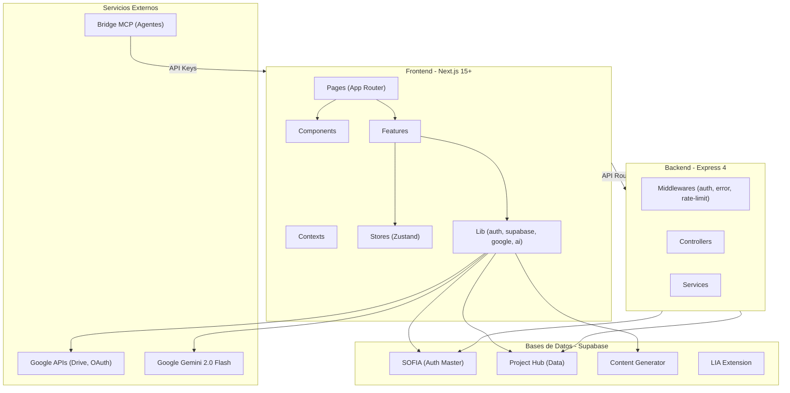

### 9.2 Arquitectura de Capas (Frontend)

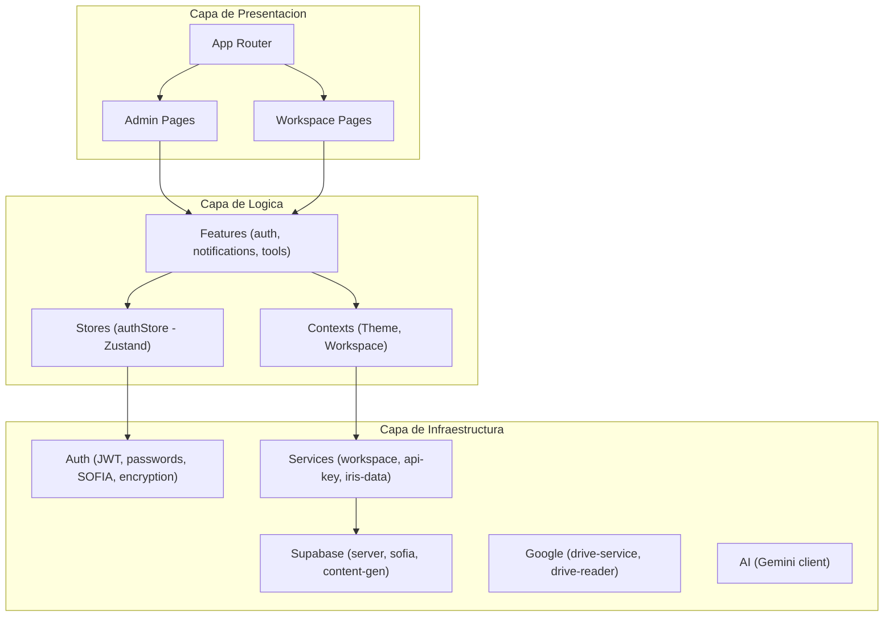

### 9.3 Flujo de Datos Multi-Supabase

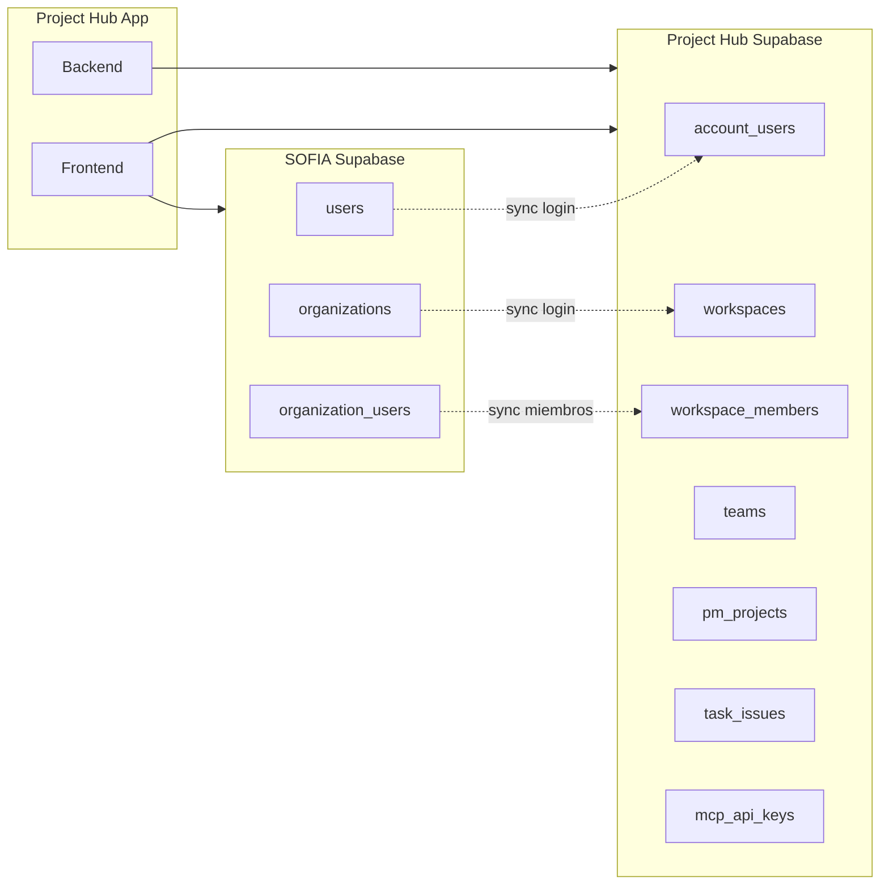

---

## 10. Diagramas de Estado

### 10.1 Estados de Tarea/Issue

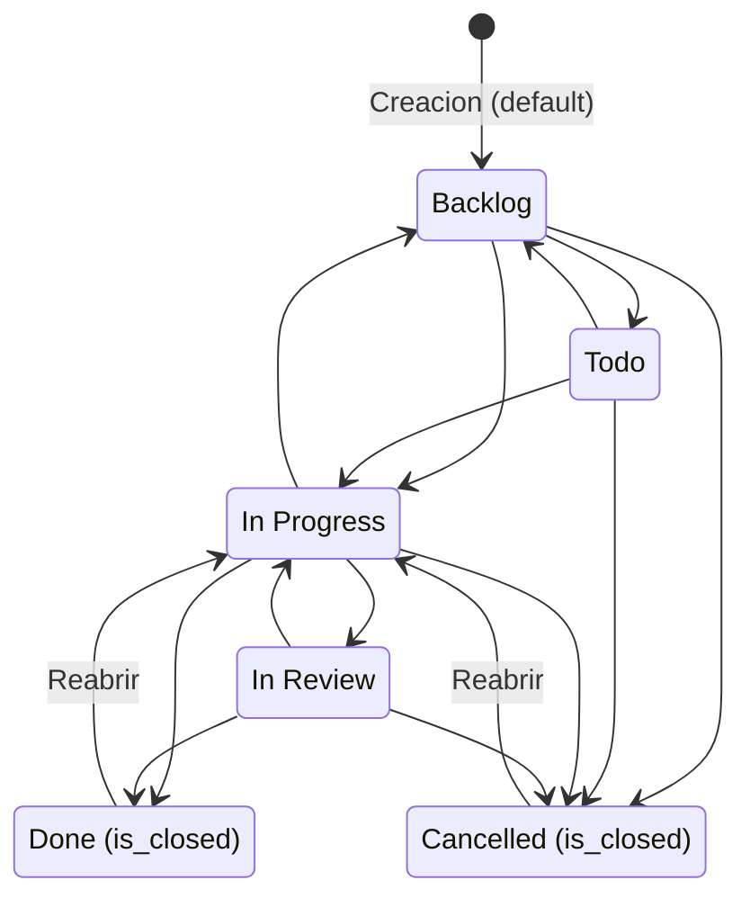

> Las transiciones son libres. Los estados Done y Cancelled tienen `is_closed = TRUE`, activando el trigger de `completed_at`.

### 10.2 Estados de Proyecto

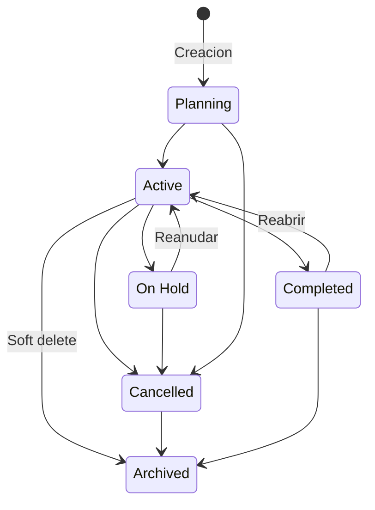

### 10.3 Estados de Ciclo/Sprint

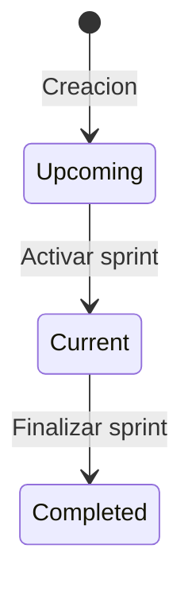

### 10.4 Estados de Cuenta de Usuario

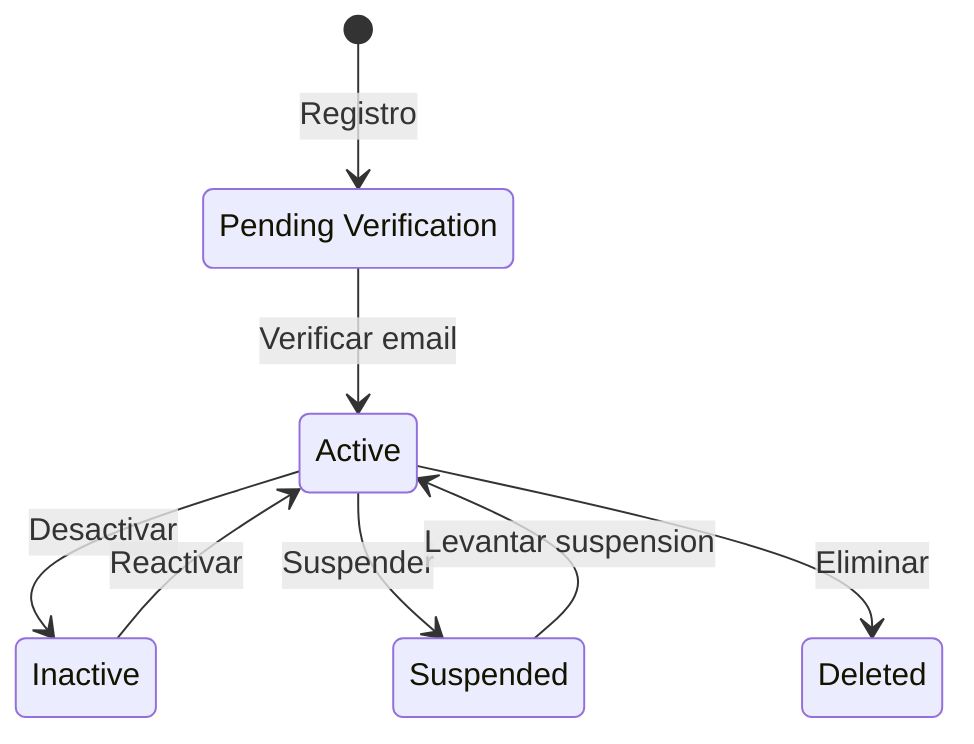

### 10.5 Estados de Milestone

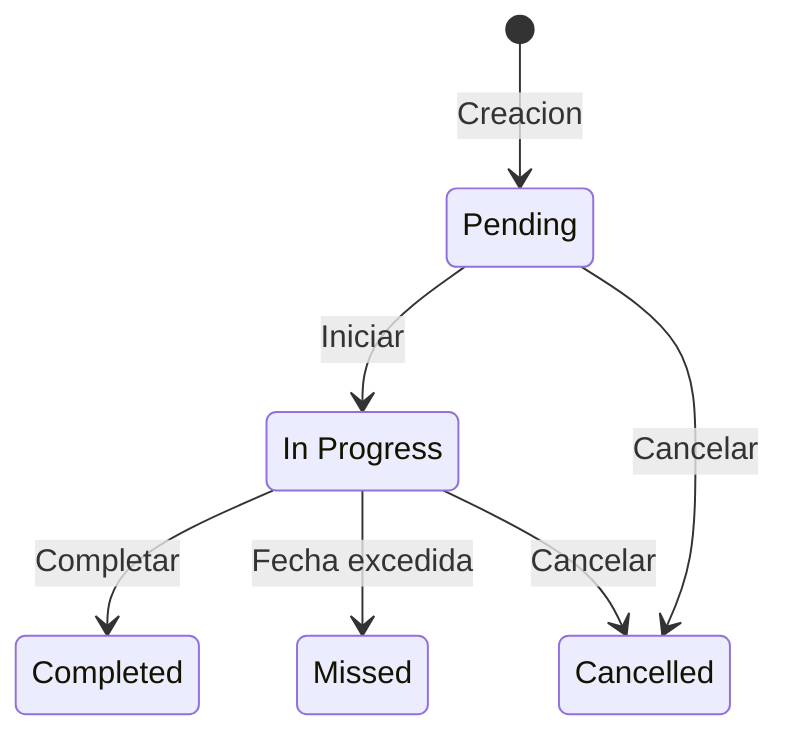

---

## 11. Diagramas de Flujo

### 11.1 Flujo de Autenticacion (Login)

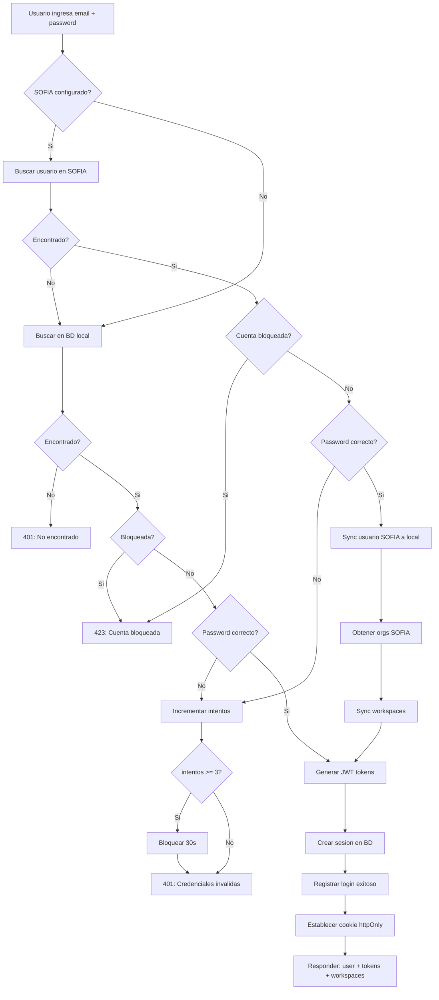

### 11.2 Flujo de Google OAuth

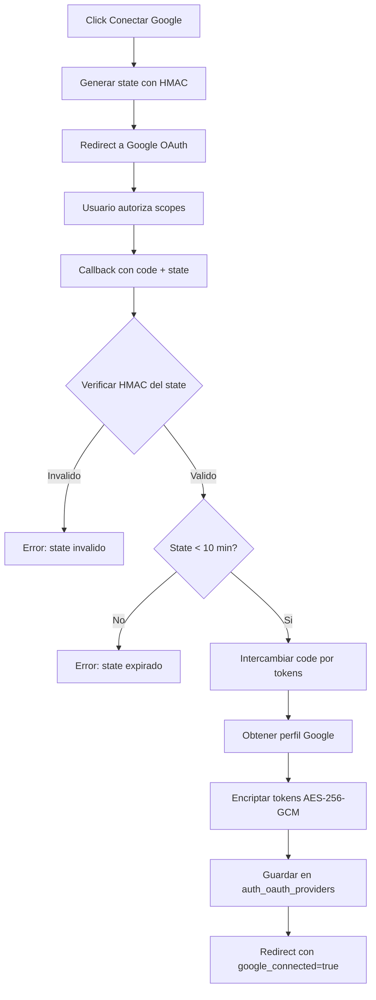

### 11.3 Flujo de Creacion de Tarea

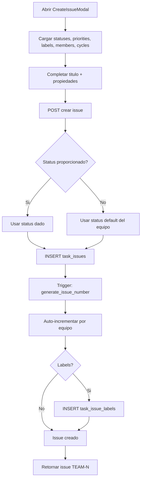

### 11.4 Flujo del Bridge MCP

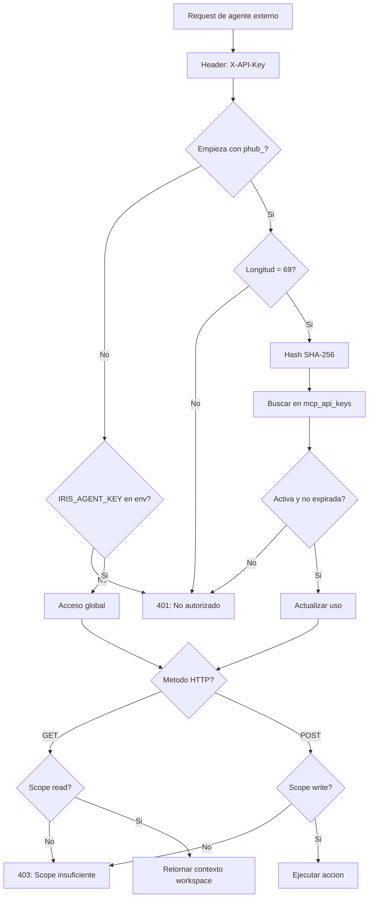

### 11.5 Flujo de Sincronizacion SOFIA

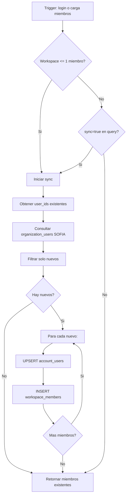

---

# BLOQUE 5 — CARACTERISTICAS DEL SISTEMA

## 12. Caracteristicas Principales

### Gestion de Proyectos

- **Proyectos aislados por workspace** con project_key auto-generado y health status
- **Tablero Kanban** con drag & drop para tareas
- **Sistema de estimaciones** con puntos para planificacion de sprints
- **Ciclos y Milestones** para tracking temporal
- **Documentos vinculados** de Google Drive con preview embebido
- **Vistas**: List, Board, Timeline
- **Identificadores extendidos**: formato `EQUIPO-PROYECTO-NUMERO`
- **Progreso visual**: barras e indicadores de salud en tarjetas

### Gestion de Equipos y Jerarquia

- **5 niveles de roles**: Owner, Admin, Manager, Leader, Member
- **Perfiles completos** con avatar, datos profesionales y preferencias
- **Consola de administracion** para ABM de usuarios
- **Sincronizacion automatica** con SOFIA (roles de Project Hub independientes)
- **Configuracion por equipo**: nombre, descripcion, lead, miembros

### Experiencia de Usuario (UX)

- **SOFIA Design System**: paleta corporativa (fondo oscuro `#1E2329`, acentos Aqua `#00D4B3`)
- **Diseno responsivo** (desktop, tablet, mobile) con Tailwind CSS
- **Tema oscuro/claro** con persistencia nativa
- **Micro-interacciones** con Framer Motion 12
- **Actualizaciones optimistas**: cambios instantaneos con sync en background
- **Calendario customizado** alineado al Design System

### Dashboard Administrativo

- **Analytics** con Recharts: KPIs, BarChart, RadarChart, PieChart, Heatmap
- **Reportes ejecutivos** PDF con @react-pdf/renderer
- **Exportacion CSV** de tareas
- **Reportes predictivos** con IA
- **Admin global** para gestion cross-workspace

### Notificaciones y Busqueda

- **Centro de notificaciones** con bell icon, badge y marcado como leido
- **Preferencias granulares** por tipo de notificacion
- **Busqueda global** cross-entity (proyectos, tareas, miembros, equipos)

### Focus Mode

- **Sesion personal**: temporizador con overlay de pantalla completa
- **Sesion grupal (admin)**: bloquea pantallas de todos los miembros del equipo

---

## 13. ARIA: Agente de IA

**ARIA** (Automated Reasoning and Interactive Assistant) es un agente activo con capacidad de ejecucion, potenciado por **Gemini 2.0 Flash** con **Function Calling**.

### Herramientas de Ejecucion

| Categoria | Accion | Descripcion |
|-----------|--------|-------------|
| Tareas | `create_task` | Genera y asigna tareas con prioridad, puntos e iteraciones |
| Tareas | `update_task_status` | Actualiza estados por conversacion natural |
| Tareas | `update_task_priority` | Ajuste de urgencias en tiempo real |
| Proyectos | `create_project` | Inicia proyecto infiriendo dominio y contexto |
| Equipo | `manage_team_member` | Administra acceso, roles y suspensiones |
| Perfil | `update_user_avatar` | Actualiza datos de usuario |
| Documentos | `analyze_documents` | Lee documentos de Drive y genera issues con IA |

### Herramientas Adicionales

| Herramienta | Endpoint | Descripcion |
|-------------|----------|-------------|
| Agile Advisor | `/api/ai/agile-advisor` | Recomienda metodologia agil |
| Diagram Generator | `/api/ai/diagram-generator` | Genera diagramas Mermaid |
| Predictive Report | `/api/ai/predictive-report` | Reportes predictivos |
| Analyze Documents | `/api/ai/analyze-documents` | Analiza documentos y crea issues |

### Capacidades

- **Contexto tenant-aware**: conoce la organizacion y workspace activo
- **Multimodalidad**: texto, imagenes, documentos de Drive
- **Streaming bidireccional**: respuestas en tiempo real
- **Niveles de razonamiento**: `thinkingLevel` configurable

---

## 14. Google Drive y Documentos

### Conexion OAuth 2.0

- **Flujo OAuth2 seguro** con scopes de Drive, Sheets y perfil
- **Tokens encriptados** con AES-256-GCM en `auth_oauth_providers`
- **Auto-refresh** con margen de 5 minutos antes de expiracion
- **State firmado** con HMAC-SHA256 y expiracion de 10 minutos (anti-CSRF)

### Funcionalidades

| Funcionalidad | Descripcion |
|----------------|-------------|
| Google Drive Picker | Selector nativo para elegir archivos de Drive |
| Vincular a Proyectos | Asociar documentos a proyectos e issues |
| Preview Embebido | Vista previa inline de Docs, Sheets y Slides |
| Subir Archivos | Upload directo al Drive del usuario |
| Crear Spreadsheets | Crear Google Spreadsheets vacios o desde templates |
| Leer Contenido | Exportar contenido como texto para analisis |
| Analisis con IA | Enviar documentos a Gemini para generar issues |
| Parseo de URLs | Deteccion automatica de URLs de Google |

### Rutas OAuth

| Metodo | Endpoint | Descripcion |
|--------|----------|-------------|
| GET | `/api/auth/google/connect` | Inicia flujo OAuth2 |
| GET | `/api/auth/callback/google` | Callback, almacena tokens |
| GET | `/api/auth/google/status` | Verifica conexion |
| POST | `/api/auth/google/disconnect` | Desconecta y revoca |
| GET | `/api/auth/google/token` | Obtiene token valido |

---

## 15. Bridge MCP y API Keys

### Sistema de API Keys

- **Generacion segura**: prefijo `phub_` + 64 chars hex, hasheadas con HMAC-SHA256
- **Scopes**: `read` y `write` configurables por key
- **Soft revoke**: desactivacion sin eliminacion para auditoria
- **Tracking**: `last_used_at` y `total_requests` actualizados atomicamente
- **Expiracion opcional**: fecha configurable

### Endpoints del Bridge

| Metodo | Endpoint | Auth | Descripcion |
|--------|----------|------|-------------|
| GET | `/api/ai/bridge` | API Key | Contexto completo del workspace |
| POST | `/api/ai/bridge` | API Key | Ejecutar acciones (6 tipos) |

### Gestion de API Keys

| Metodo | Endpoint | Descripcion |
|--------|----------|-------------|
| GET | `/api/workspaces/:slug/api-keys` | Lista API keys |
| POST | `/api/workspaces/:slug/api-keys` | Genera nueva key |
| DELETE | `/api/workspaces/:slug/api-keys/:id` | Revoca key |

### Endpoints Externos (LIA Extension)

| Metodo | Endpoint | Descripcion |
|--------|----------|-------------|
| GET | `/api/ext/projects` | Lista proyectos |
| GET | `/api/ext/issues` | Lista issues |

---

# BLOQUE 6 — DATOS

## 16. Diccionario de Datos

La base de datos PostgreSQL (via Supabase) contiene **27+ tablas** organizadas en 6 dominios.

### Dominio 1: Autenticacion y Usuarios

#### `account_users`
Tabla principal de usuarios. Sincronizada desde SOFIA.

| Columna | Tipo | Constraints | Descripcion |
|---------|------|-------------|-------------|
| user_id | UUID | PK, DEFAULT uuid_generate_v4() | Identificador unico |
| first_name | VARCHAR(100) | NOT NULL | Nombre |
| last_name_paternal | VARCHAR(100) | NOT NULL | Apellido paterno |
| last_name_maternal | VARCHAR(100) | NULL | Apellido materno |
| display_name | VARCHAR(200) | NULL | Nombre para mostrar |
| username | VARCHAR(50) | UNIQUE, NOT NULL | Nombre de usuario |
| email | VARCHAR(255) | UNIQUE, NOT NULL | Correo electronico |
| password_hash | TEXT | NOT NULL | Hash PBKDF2 |
| permission_level | VARCHAR(20) | CHECK, DEFAULT 'user' | super_admin / admin / manager / user / viewer / guest |
| company_role | VARCHAR(100) | NULL | Puesto en la empresa |
| department | VARCHAR(100) | NULL | Departamento |
| account_status | VARCHAR(30) | CHECK, DEFAULT 'active' | active / inactive / suspended / pending_verification / deleted |
| is_email_verified | BOOLEAN | DEFAULT false | Email verificado |
| avatar_url | TEXT | NULL | URL del avatar |
| phone_number | VARCHAR(20) | NULL | Telefono |
| timezone | VARCHAR(50) | DEFAULT 'America/Mexico_City' | Zona horaria |
| locale | VARCHAR(10) | DEFAULT 'es-MX' | Locale |
| failed_login_attempts | INTEGER | DEFAULT 0 | Intentos fallidos |
| locked_until | TIMESTAMPTZ | NULL | Bloqueo hasta |
| last_login_at | TIMESTAMPTZ | NULL | Ultimo login |
| created_at | TIMESTAMPTZ | DEFAULT NOW() | Creacion |
| updated_at | TIMESTAMPTZ | DEFAULT NOW() | Actualizacion |

**Triggers:** `trigger_account_users_updated_at` — auto-actualiza `updated_at`.

#### `auth_sessions`

| Columna | Tipo | Constraints | Descripcion |
|---------|------|-------------|-------------|
| session_id | UUID | PK | ID de sesion |
| user_id | UUID | FK -> account_users | Usuario |
| token_hash | TEXT | NOT NULL | Hash del access token |
| refresh_token_hash | TEXT | NULL | Hash del refresh token |
| device_type | VARCHAR(50) | NULL | Tipo de dispositivo |
| browser | VARCHAR(100) | NULL | Navegador |
| ip_address | INET | NULL | IP del cliente |
| is_active | BOOLEAN | DEFAULT true | Sesion activa |
| expires_at | TIMESTAMPTZ | NOT NULL | Expiracion |
| created_at | TIMESTAMPTZ | DEFAULT NOW() | Creacion |

#### `auth_refresh_tokens`

| Columna | Tipo | Constraints | Descripcion |
|---------|------|-------------|-------------|
| token_id | UUID | PK | ID |
| user_id | UUID | FK -> account_users | Usuario |
| token_hash | TEXT | UNIQUE, NOT NULL | Hash del refresh token |
| is_revoked | BOOLEAN | DEFAULT false | Revocado |
| expires_at | TIMESTAMPTZ | NOT NULL | Expiracion |
| created_at | TIMESTAMPTZ | DEFAULT NOW() | Creacion |

#### `auth_login_history`

| Columna | Tipo | Constraints | Descripcion |
|---------|------|-------------|-------------|
| history_id | UUID | PK | ID |
| user_id | UUID | FK, NULL | Usuario (null si no encontrado) |
| email_attempted | VARCHAR(255) | NOT NULL | Email intentado |
| status | VARCHAR(30) | CHECK | success / failed_password / failed_user_not_found / account_locked |
| ip_address | INET | NULL | IP |
| user_agent | TEXT | NULL | User agent |
| device_type | VARCHAR(50) | NULL | Dispositivo |
| created_at | TIMESTAMPTZ | DEFAULT NOW() | Timestamp |

#### `auth_oauth_providers`

| Columna | Tipo | Constraints | Descripcion |
|---------|------|-------------|-------------|
| oauth_id | UUID | PK | ID |
| user_id | UUID | FK -> account_users | Usuario |
| provider_name | VARCHAR(50) | NOT NULL | Proveedor (google) |
| provider_user_id | VARCHAR(255) | NULL | ID en proveedor |
| provider_email | VARCHAR(255) | NULL | Email del proveedor |
| access_token_encrypted | TEXT | NULL | Token encriptado AES-256-GCM |
| refresh_token_encrypted | TEXT | NULL | Refresh encriptado |
| token_expires_at | TIMESTAMPTZ | NULL | Expiracion del token |
| scopes | TEXT | NULL | Scopes autorizados |
| created_at | TIMESTAMPTZ | DEFAULT NOW() | Creacion |
| updated_at | TIMESTAMPTZ | DEFAULT NOW() | Actualizacion |

**Constraint:** UNIQUE(user_id, provider_name)

#### `auth_password_resets`

| Columna | Tipo | Constraints | Descripcion |
|---------|------|-------------|-------------|
| reset_id | UUID | PK | ID |
| user_id | UUID | FK | Usuario |
| token_hash | TEXT | UNIQUE, NOT NULL | Hash del token |
| is_used | BOOLEAN | DEFAULT false | Usado |
| expires_at | TIMESTAMPTZ | NOT NULL | Expiracion |

#### `auth_email_verifications`

| Columna | Tipo | Constraints | Descripcion |
|---------|------|-------------|-------------|
| verification_id | UUID | PK | ID |
| user_id | UUID | FK | Usuario |
| token_hash | TEXT | UNIQUE, NOT NULL | Hash del token |
| is_used | BOOLEAN | DEFAULT false | Usado |
| expires_at | TIMESTAMPTZ | NOT NULL | Expiracion |

#### `user_permissions`

| Columna | Tipo | Constraints | Descripcion |
|---------|------|-------------|-------------|
| permission_id | UUID | PK | ID |
| user_id | UUID | FK | Usuario |
| permission_name | VARCHAR(100) | NOT NULL | Nombre del permiso |
| is_granted | BOOLEAN | DEFAULT true | Otorgado |
| granted_by | UUID | FK, NULL | Quien otorgo |

**Funciones SQL:** `handle_failed_login(p_user_id)`, `reset_failed_login_attempts(p_user_id)`

---

### Dominio 2: Equipos

#### `teams`

| Columna | Tipo | Constraints | Descripcion |
|---------|------|-------------|-------------|
| team_id | UUID | PK | ID |
| workspace_id | UUID | FK -> workspaces | Workspace |
| name | VARCHAR(100) | NOT NULL | Nombre |
| slug | VARCHAR(100) | NULL | Slug URL |
| description | TEXT | NULL | Descripcion |
| color | VARCHAR(7) | DEFAULT '#6366F1' | Color hex |
| visibility | VARCHAR(20) | CHECK, DEFAULT 'private' | private / internal / public |
| status | VARCHAR(20) | CHECK, DEFAULT 'active' | active / archived / suspended |
| owner_id | UUID | FK, NULL | Owner |
| max_members | INTEGER | DEFAULT 50 | Max miembros |
| created_at | TIMESTAMPTZ | DEFAULT NOW() | Creacion |

**Trigger:** `trg_team_default_statuses` — crea 5 estados automaticamente al insertar equipo.

#### `team_members`

| Columna | Tipo | Constraints | Descripcion |
|---------|------|-------------|-------------|
| member_id | UUID | PK | ID |
| team_id | UUID | FK -> teams | Equipo |
| user_id | UUID | FK -> account_users | Usuario |
| role | VARCHAR(20) | CHECK, DEFAULT 'member' | lead / member |
| status | VARCHAR(20) | DEFAULT 'active' | Estado |
| joined_at | TIMESTAMPTZ | DEFAULT NOW() | Ingreso |

**Constraint:** UNIQUE(team_id, user_id)

---

### Dominio 3: Proyectos

#### `pm_projects`

| Columna | Tipo | Constraints | Descripcion |
|---------|------|-------------|-------------|
| project_id | UUID | PK | ID |
| workspace_id | UUID | FK -> workspaces | Workspace |
| team_id | UUID | FK -> teams, NULL | Equipo |
| name | VARCHAR(200) | NOT NULL | Nombre |
| project_key | VARCHAR(20) | UNIQUE, NOT NULL | Clave (DEMO-001) |
| description | TEXT | NULL | Descripcion |
| project_status | VARCHAR(20) | CHECK, DEFAULT 'planning' | planning / active / on_hold / completed / cancelled / archived |
| health_status | VARCHAR(20) | CHECK, DEFAULT 'none' | on_track / at_risk / off_track / none |
| priority | VARCHAR(20) | DEFAULT 'medium' | Prioridad |
| lead_user_id | UUID | FK, NULL | Lider |
| created_by_user_id | UUID | FK, NULL | Creador |
| start_date | DATE | NULL | Fecha inicio |
| target_date | DATE | NULL | Fecha objetivo |
| completion_percentage | INTEGER | DEFAULT 0 | % completado |
| figma_url | TEXT | NULL | URL Figma |
| notion_url | TEXT | NULL | URL Notion |
| github_url | TEXT | NULL | URL GitHub |
| drive_url | TEXT | NULL | URL Drive |
| created_at | TIMESTAMPTZ | DEFAULT NOW() | Creacion |

#### `pm_project_members`

| Columna | Tipo | Constraints | Descripcion |
|---------|------|-------------|-------------|
| member_id | UUID | PK | ID |
| project_id | UUID | FK | Proyecto |
| user_id | UUID | FK | Usuario |
| role | VARCHAR(20) | DEFAULT 'member' | owner / admin / member / viewer |
| can_edit | BOOLEAN | DEFAULT true | Permiso edicion |

#### `pm_milestones`

| Columna | Tipo | Constraints | Descripcion |
|---------|------|-------------|-------------|
| milestone_id | UUID | PK | ID |
| project_id | UUID | FK | Proyecto |
| name | VARCHAR(200) | NOT NULL | Nombre |
| description | TEXT | NULL | Descripcion |
| status | VARCHAR(20) | CHECK, DEFAULT 'pending' | pending / in_progress / completed / missed / cancelled |
| due_date | DATE | NULL | Fecha limite |
| completed_at | TIMESTAMPTZ | NULL | Completado |

#### `pm_project_progress_history`

| Columna | Tipo | Constraints | Descripcion |
|---------|------|-------------|-------------|
| history_id | UUID | PK | ID |
| project_id | UUID | FK | Proyecto |
| completion_percentage | INTEGER | NOT NULL | % completado |
| total_issues | INTEGER | DEFAULT 0 | Total issues |
| completed_issues | INTEGER | DEFAULT 0 | Completados |
| recorded_at | TIMESTAMPTZ | DEFAULT NOW() | Timestamp |

#### `pm_project_updates`

| Columna | Tipo | Constraints | Descripcion |
|---------|------|-------------|-------------|
| update_id | UUID | PK | ID |
| project_id | UUID | FK | Proyecto |
| author_id | UUID | FK | Autor |
| title | VARCHAR(200) | NULL | Titulo |
| content | TEXT | NOT NULL | Contenido |
| update_type | VARCHAR(20) | DEFAULT 'general' | general / status / milestone / risk |

#### `pm_project_documents`

| Columna | Tipo | Constraints | Descripcion |
|---------|------|-------------|-------------|
| document_id | UUID | PK | ID |
| project_id | UUID | FK | Proyecto |
| name | VARCHAR(255) | NOT NULL | Nombre |
| external_id | VARCHAR(255) | NOT NULL | ID en Google Drive |
| provider | VARCHAR(50) | DEFAULT 'google_drive' | Proveedor |
| mime_type | VARCHAR(100) | NULL | Tipo MIME |
| doc_type | VARCHAR(50) | NULL | document / spreadsheet / presentation / file |
| url | TEXT | NULL | URL directa |
| linked_by | UUID | FK | Quien vinculo |

**Funciones SQL:** `record_project_progress(p_project_id)`, `get_project_sparkline_data(p_project_id, p_days)`

---

### Dominio 4: Tareas

#### `task_statuses`

| Columna | Tipo | Constraints | Descripcion |
|---------|------|-------------|-------------|
| status_id | UUID | PK | ID |
| team_id | UUID | FK -> teams | Equipo |
| name | VARCHAR(50) | NOT NULL | Nombre |
| color | VARCHAR(7) | DEFAULT '#6B7280' | Color |
| position | INTEGER | DEFAULT 0 | Orden |
| status_type | VARCHAR(20) | CHECK | backlog / todo / in_progress / in_review / done / cancelled |
| is_default | BOOLEAN | DEFAULT false | Default |
| is_closed | BOOLEAN | DEFAULT false | Cerrado (done/cancelled) |

#### `task_priorities`

| Columna | Tipo | Constraints | Descripcion |
|---------|------|-------------|-------------|
| priority_id | UUID | PK | ID |
| name | VARCHAR(50) | NOT NULL | Nombre |
| color | VARCHAR(7) | NOT NULL | Color |
| level | INTEGER | UNIQUE, NOT NULL | Nivel (0-4) |

**Valores:** No Priority (0), Urgent (1), High (2), Medium (3), Low (4)

#### `task_labels`

| Columna | Tipo | Constraints | Descripcion |
|---------|------|-------------|-------------|
| label_id | UUID | PK | ID |
| team_id | UUID | FK -> teams | Equipo |
| name | VARCHAR(50) | NOT NULL | Nombre |
| color | VARCHAR(7) | DEFAULT '#6B7280' | Color |

#### `task_cycles`

| Columna | Tipo | Constraints | Descripcion |
|---------|------|-------------|-------------|
| cycle_id | UUID | PK | ID |
| team_id | UUID | FK -> teams | Equipo |
| project_id | UUID | FK, NULL | Proyecto |
| name | VARCHAR(100) | NOT NULL | Nombre |
| status | VARCHAR(20) | CHECK, DEFAULT 'upcoming' | upcoming / current / completed |
| start_date | DATE | NOT NULL | Inicio |
| end_date | DATE | NOT NULL | Fin |

**Constraint:** CHECK(end_date >= start_date)

#### `task_issues`

| Columna | Tipo | Constraints | Descripcion |
|---------|------|-------------|-------------|
| issue_id | UUID | PK | ID |
| team_id | UUID | FK, NOT NULL | Equipo |
| project_id | UUID | FK, NULL | Proyecto |
| issue_number | INTEGER | NOT NULL | Auto-incremental por equipo |
| title | VARCHAR(500) | NOT NULL | Titulo |
| description | TEXT | NULL | Descripcion |
| status_id | UUID | FK -> task_statuses | Estado |
| priority_id | UUID | FK, NULL | Prioridad |
| assignee_id | UUID | FK, NULL | Asignado |
| creator_id | UUID | FK | Creador |
| cycle_id | UUID | FK, NULL | Ciclo |
| parent_issue_id | UUID | FK, NULL | Issue padre (subtarea) |
| due_date | DATE | NULL | Fecha limite |
| estimate_points | INTEGER | NULL | Puntos estimacion |
| started_at | TIMESTAMPTZ | NULL | Inicio real |
| completed_at | TIMESTAMPTZ | NULL | Completado (auto por trigger) |
| archived_at | TIMESTAMPTZ | NULL | Soft delete |
| created_at | TIMESTAMPTZ | DEFAULT NOW() | Creacion |
| updated_at | TIMESTAMPTZ | DEFAULT NOW() | Actualizacion |

**Triggers:**
- `trg_issue_number` -> `generate_issue_number()`: auto-incrementa por equipo
- `trg_issue_completion` -> `update_issue_completion()`: establece/limpia completed_at

**Constraint:** UNIQUE(team_id, issue_number)

#### `task_issue_labels`

| Columna | Tipo | Constraints | Descripcion |
|---------|------|-------------|-------------|
| issue_id | UUID | FK -> task_issues | Issue |
| label_id | UUID | FK -> task_labels | Label |

**Constraint:** PK(issue_id, label_id)

#### `task_issue_comments`

| Columna | Tipo | Constraints | Descripcion |
|---------|------|-------------|-------------|
| comment_id | UUID | PK | ID |
| issue_id | UUID | FK | Issue |
| author_id | UUID | FK | Autor |
| content | TEXT | NOT NULL | Contenido |
| created_at | TIMESTAMPTZ | DEFAULT NOW() | Creacion |

#### `task_issue_history`

| Columna | Tipo | Constraints | Descripcion |
|---------|------|-------------|-------------|
| history_id | UUID | PK | ID |
| issue_id | UUID | FK | Issue |
| changed_by | UUID | FK | Quien cambio |
| field_name | VARCHAR(50) | NOT NULL | Campo modificado |
| old_value | TEXT | NULL | Valor anterior |
| new_value | TEXT | NULL | Valor nuevo |
| old_value_id | UUID | NULL | ID valor anterior |
| new_value_id | UUID | NULL | ID valor nuevo |
| created_at | TIMESTAMPTZ | DEFAULT NOW() | Timestamp |

#### `task_issue_relations`

| Columna | Tipo | Constraints | Descripcion |
|---------|------|-------------|-------------|
| relation_id | UUID | PK | ID |
| source_issue_id | UUID | FK | Issue origen |
| target_issue_id | UUID | FK | Issue destino |
| relation_type | VARCHAR(20) | CHECK | blocks / is_blocked_by / relates_to / duplicates / is_duplicated_by |
| created_by | UUID | FK | Creador |

**Constraint:** CHECK(source_issue_id != target_issue_id)

#### `task_issue_subscribers`

| Columna | Tipo | Constraints | Descripcion |
|---------|------|-------------|-------------|
| issue_id | UUID | FK | Issue |
| user_id | UUID | FK | Usuario |

**Constraint:** PK(issue_id, user_id)

#### `task_issue_attachments`

| Columna | Tipo | Constraints | Descripcion |
|---------|------|-------------|-------------|
| attachment_id | UUID | PK | ID |
| issue_id | UUID | FK | Issue |
| uploaded_by | UUID | FK | Quien subio |
| file_name | VARCHAR(255) | NOT NULL | Nombre |
| file_url | TEXT | NOT NULL | URL |
| file_size | BIGINT | NULL | Tamano bytes |
| mime_type | VARCHAR(100) | NULL | Tipo MIME |

#### `task_issue_documents`

| Columna | Tipo | Constraints | Descripcion |
|---------|------|-------------|-------------|
| document_id | UUID | PK | ID |
| issue_id | UUID | FK | Issue |
| name | VARCHAR(255) | NOT NULL | Nombre |
| external_id | VARCHAR(255) | NOT NULL | ID externo (Google) |
| provider | VARCHAR(50) | DEFAULT 'google_drive' | Proveedor |
| mime_type | VARCHAR(100) | NULL | Tipo MIME |
| linked_by | UUID | FK | Quien vinculo |

#### `task_saved_views`

| Columna | Tipo | Constraints | Descripcion |
|---------|------|-------------|-------------|
| view_id | UUID | PK | ID |
| team_id | UUID | FK | Equipo |
| user_id | UUID | FK | Usuario |
| name | VARCHAR(100) | NOT NULL | Nombre |
| filters | JSONB | DEFAULT '{}' | Filtros |
| settings | JSONB | DEFAULT '{}' | Configuracion |

---

### Dominio 5: Workspaces

#### `workspaces`

| Columna | Tipo | Constraints | Descripcion |
|---------|------|-------------|-------------|
| workspace_id | UUID | PK | ID |
| sofia_org_id | UUID | UNIQUE, NOT NULL | ID org en SOFIA |
| name | VARCHAR(200) | NOT NULL | Nombre |
| slug | VARCHAR(100) | UNIQUE, NOT NULL | Slug para URL |
| description | TEXT | NULL | Descripcion |
| logo_url | TEXT | NULL | URL logo |
| brand_color | VARCHAR(7) | DEFAULT '#6366F1' | Color marca |
| is_active | BOOLEAN | DEFAULT true | Activo |
| settings | JSONB | DEFAULT '{}' | Configuraciones |

#### `workspace_members`

| Columna | Tipo | Constraints | Descripcion |
|---------|------|-------------|-------------|
| member_id | UUID | PK | ID |
| workspace_id | UUID | FK -> workspaces | Workspace |
| user_id | UUID | FK -> account_users | Usuario |
| sofia_role | VARCHAR(50) | NULL | Rol en SOFIA (informativo) |
| iris_role | VARCHAR(20) | CHECK, DEFAULT 'member' | owner / admin / manager / leader / member |
| is_active | BOOLEAN | DEFAULT true | Activo |
| joined_at | TIMESTAMPTZ | DEFAULT NOW() | Ingreso |

**Constraint:** UNIQUE(workspace_id, user_id)

#### `mcp_api_keys`

| Columna | Tipo | Constraints | Descripcion |
|---------|------|-------------|-------------|
| key_id | UUID | PK | ID |
| workspace_id | UUID | FK -> workspaces | Workspace |
| created_by | UUID | FK | Creador |
| name | VARCHAR(100) | NOT NULL | Nombre descriptivo |
| key_prefix | VARCHAR(12) | NOT NULL | Primeros 12 chars |
| key_hash | TEXT | UNIQUE, NOT NULL | Hash HMAC-SHA256 |
| scopes | TEXT[] | DEFAULT '{read}' | read, write |
| is_active | BOOLEAN | DEFAULT true | Activa |
| last_used_at | TIMESTAMPTZ | NULL | Ultimo uso |
| total_requests | INTEGER | DEFAULT 0 | Total requests |
| expires_at | TIMESTAMPTZ | NULL | Expiracion |
| revoked_at | TIMESTAMPTZ | NULL | Revocacion |

---

### Dominio 6: Sistema

#### `notifications`

| Columna | Tipo | Constraints | Descripcion |
|---------|------|-------------|-------------|
| notification_id | UUID | PK | ID |
| recipient_id | UUID | FK, NOT NULL | Destinatario |
| actor_id | UUID | FK, NULL | Quien genero |
| title | TEXT | NOT NULL | Titulo |
| message | TEXT | NULL | Mensaje |
| type | VARCHAR(20) | CHECK, DEFAULT 'info' | info / success / warning / error |
| category | VARCHAR(50) | NULL | task / project / team / comment / reminder / system |
| entity_id | UUID | NULL | ID recurso relacionado |
| link | TEXT | NULL | URL relativa |
| is_read | BOOLEAN | DEFAULT false | Leida |
| read_at | TIMESTAMPTZ | NULL | Fecha lectura (auto trigger) |

**Trigger:** `trg_notification_read_at` — al cambiar `is_read` a TRUE, establece `read_at = NOW()`.

#### `user_notification_preferences`

| Columna | Tipo | Constraints | Descripcion |
|---------|------|-------------|-------------|
| preference_id | UUID | PK | ID |
| user_id | UUID | FK, UNIQUE | Usuario |
| email_daily_summary | BOOLEAN | DEFAULT false | Resumen diario |
| soflia_enabled | BOOLEAN | DEFAULT true | Notificaciones SOFLIA |
| soflia_issues | BOOLEAN | DEFAULT true | Notificar issues |
| soflia_projects | BOOLEAN | DEFAULT true | Notificar proyectos |
| soflia_team_updates | BOOLEAN | DEFAULT true | Notificar equipos |
| soflia_mentions | BOOLEAN | DEFAULT true | Notificar menciones |
| soflia_reminders | BOOLEAN | DEFAULT true | Notificar recordatorios |

#### `faqs`

| Columna | Tipo | Constraints | Descripcion |
|---------|------|-------------|-------------|
| faq_id | UUID | PK | ID |
| question | TEXT | NOT NULL | Pregunta |
| answer | TEXT | NOT NULL | Respuesta |
| category | VARCHAR(50) | DEFAULT 'general' | general / projects / account / technical / billing |
| position | INTEGER | DEFAULT 0 | Orden |
| is_active | BOOLEAN | DEFAULT true | Activa |

#### `focus_sessions`

| Columna | Tipo | Constraints | Descripcion |
|---------|------|-------------|-------------|
| session_id | UUID | PK | ID |
| user_id | UUID | FK | Usuario que inicio |
| team_id | UUID | FK, NULL | Equipo (NULL si personal) |
| task_name | VARCHAR(255) | NOT NULL | Tarea |
| duration_minutes | INTEGER | NOT NULL | Duracion minutos |
| started_at | TIMESTAMPTZ | DEFAULT NOW() | Inicio |
| ends_at | TIMESTAMPTZ | NOT NULL | Fin esperado |
| is_active | BOOLEAN | DEFAULT true | Activa |

#### `aria_usage_logs`

| Columna | Tipo | Constraints | Descripcion |
|---------|------|-------------|-------------|
| log_id | UUID | PK | ID |
| user_id | UUID | FK | Usuario |
| action_type | VARCHAR(50) | NOT NULL | Tipo accion |
| tokens_used | INTEGER | DEFAULT 0 | Tokens consumidos |
| model | VARCHAR(50) | NULL | Modelo usado |

#### `aria_chat_attachments`

| Columna | Tipo | Constraints | Descripcion |
|---------|------|-------------|-------------|
| attachment_id | UUID | PK | ID |
| user_id | UUID | FK | Usuario |
| file_name | VARCHAR(255) | NOT NULL | Nombre |
| mime_type | VARCHAR(100) | NOT NULL | Tipo MIME |
| file_data | TEXT | NOT NULL | Datos base64 |

### Vistas SQL

| Vista | Descripcion |
|-------|-------------|
| `v_projects_summary` | Proyectos con info calculada, filtra archived |
| `v_task_issues_full` | Issues con toda la info relacionada, filtra archived_at IS NULL |

---

# BLOQUE 7 — PRUEBAS

## 17. Mapeo de Pruebas

### Autenticacion

| Requisito | Caso de Prueba | Tipo | Escenario |
|-----------|----------------|------|-----------|
| RF-AUTH-001 | Login exitoso con credenciales SOFIA validas | Integracion | Positivo |
| RF-AUTH-001 | Fallback a login local cuando SOFIA no encuentra usuario | Integracion | Alternativo |
| RF-AUTH-001 | Rechazo con contrasena incorrecta | Integracion | Negativo |
| RF-AUTH-003 | Bloqueo tras 3 intentos fallidos | Integracion | Negativo |
| RF-AUTH-003 | Desbloqueo despues de 30 segundos | Integracion | Positivo |
| RF-AUTH-004 | Renovacion con refresh token valido | Integracion | Positivo |
| RF-AUTH-004 | Rechazo de refresh token expirado | Integracion | Negativo |
| RF-AUTH-005 | Revocacion de sesion al logout | Integracion | Positivo |
| RF-AUTH-007 | Cambio de contrasena con actual correcta | Integracion | Positivo |
| RF-AUTH-007 | Rechazo con contrasena actual incorrecta | Integracion | Negativo |
| RF-AUTH-009 | Sincronizacion de datos SOFIA al login | Integracion | Positivo |

### Workspaces

| Requisito | Caso de Prueba | Tipo | Escenario |
|-----------|----------------|------|-----------|
| RF-WS-001 | Creacion automatica de workspace al sync org SOFIA | Integracion | Positivo |
| RF-WS-003 | Sincronizacion de miembros nuevos desde SOFIA | Integracion | Positivo |
| RF-WS-003 | iris_role existente NO se sobreescribe al sincronizar | Integracion | Critico |
| RF-WS-004 | Cambio de rol por owner/admin | Integracion | Positivo |
| RF-WS-004 | Rechazo de cambio de rol por usuario sin permiso | Integracion | Negativo |
| RF-WS-005 | Permisos correctos para cada uno de los 5 roles | Unitaria | Positivo |

### Equipos

| Requisito | Caso de Prueba | Tipo | Escenario |
|-----------|----------------|------|-----------|
| RF-TEAM-001 | Creacion de equipo con datos validos | Integracion | Positivo |
| RF-TEAM-002 | 5 estados creados automaticamente al crear equipo | Integracion | Positivo |
| RF-TEAM-003 | Agregar miembro a equipo | Integracion | Positivo |
| RF-TEAM-003 | Restriccion de duplicados (mismo user en mismo team) | Integracion | Negativo |

### Proyectos

| Requisito | Caso de Prueba | Tipo | Escenario |
|-----------|----------------|------|-----------|
| RF-PROJ-001 | Creacion de proyecto con datos minimos | Integracion | Positivo |
| RF-PROJ-002 | Generacion correcta de project_key | Unitaria | Positivo |
| RF-PROJ-003 | Calculo de progreso: 0% sin issues | Unitaria | Borde |
| RF-PROJ-003 | Calculo de progreso: exclusion de cancelados | Unitaria | Positivo |
| RF-PROJ-004 | Transiciones de estado del proyecto | Integracion | Positivo |
| RF-PROJ-010 | Archivado de proyecto (soft delete) | Integracion | Positivo |

### Tareas/Issues

| Requisito | Caso de Prueba | Tipo | Escenario |
|-----------|----------------|------|-----------|
| RF-TASK-001 | Creacion de issue con titulo minimo | Integracion | Positivo |
| RF-TASK-002 | Auto-incremento de issue_number por equipo | Integracion | Positivo |
| RF-TASK-002 | Numeracion independiente entre equipos | Integracion | Positivo |
| RF-TASK-004 | Registro en task_issue_history al cambiar campo | Integracion | Positivo |
| RF-TASK-005 | completed_at se establece al mover a Done | Integracion | Positivo |
| RF-TASK-005 | completed_at se limpia al reabrir issue | Integracion | Positivo |
| RF-TASK-007 | Prohibicion de auto-relacion (source = target) | Integracion | Negativo |
| RF-TASK-011 | Soft delete establece archived_at | Integracion | Positivo |

### Google Drive

| Requisito | Caso de Prueba | Tipo | Escenario |
|-----------|----------------|------|-----------|
| RF-GD-001 | Flujo OAuth completo: connect -> callback -> tokens | E2E | Positivo |
| RF-GD-002 | Encriptacion AES-256-GCM de tokens | Unitaria | Positivo |
| RF-GD-003 | Auto-refresh de token expirado | Integracion | Positivo |
| RF-GD-001 | Desconexion revoca token y elimina registro | Integracion | Positivo |

### Bridge MCP

| Requisito | Caso de Prueba | Tipo | Escenario |
|-----------|----------------|------|-----------|
| RF-MCP-001 | Generacion de API key con formato phub_ + 64 hex | Unitaria | Positivo |
| RF-MCP-001 | Key en texto plano no se almacena en BD | Unitaria | Seguridad |
| RF-MCP-003 | GET bridge retorna contexto con key valida | Integracion | Positivo |
| RF-MCP-004 | POST bridge ejecuta create_task con scope write | Integracion | Positivo |
| RF-MCP-005 | Rechazo de POST sin scope write | Integracion | Negativo |
| RF-MCP-002 | Revocacion de key (soft delete) | Integracion | Positivo |
| RF-MCP-005 | Rechazo de key expirada | Integracion | Negativo |
| RF-MCP-005 | Rechazo de key revocada | Integracion | Negativo |

### Notificaciones

| Requisito | Caso de Prueba | Tipo | Escenario |
|-----------|----------------|------|-----------|
| RF-NOTIF-001 | Envio de notificacion individual | Integracion | Positivo |
| RF-NOTIF-002 | Envio a todos los miembros del equipo | Integracion | Positivo |
| RF-NOTIF-003 | Marcado como leida establece read_at via trigger | Integracion | Positivo |

### Seguridad (No Funcionales)

| Requisito | Caso de Prueba | Tipo | Escenario |
|-----------|----------------|------|-----------|
| RNF-005 | Firma HMAC-SHA256 de JWT | Unitaria | Seguridad |
| RNF-009 | Rate limiting rechaza tras 100 req/15min | Integracion | Seguridad |
| RNF-011 | Cookie httpOnly no accesible desde JavaScript | E2E | Seguridad |
| RNF-012 | State de OAuth expira despues de 10 minutos | Integracion | Seguridad |

---

# BLOQUE 8 — TECNICO

## 18. Stack Tecnologico

### Frontend (`apps/web`)

| Tecnologia | Version | Uso |
|-----------|---------|-----|
| Next.js | 15+ | Framework y App Router |
| React | 18.3 | UI Library |
| TypeScript | 5.9 | Lenguaje |
| TailwindCSS | 3.4 | Estilos y Responsividad |
| Framer Motion | 12+ | Animaciones |
| Zustand | 5 | Estado global |
| Recharts | 3.6 | Graficas y Analytics |
| Mermaid | 11+ | Diagramas |
| React Hook Form | 7 | Formularios |
| Zod | 3.25 | Validacion |
| Lucide React | 0.545 | Iconografia |
| @react-pdf/renderer | 4.3 | Generacion PDFs |
| SWR | 2.2 | Data fetching |
| @google/generative-ai | 0.24 | Gemini AI SDK |
| date-fns | 3.6 | Manejo de fechas |

### Backend (`apps/api`)

| Tecnologia | Version | Uso |
|-----------|---------|-----|
| Express | 4.18 | HTTP Server |
| TypeScript | 5.3 | Lenguaje |
| Zod | 3.25 | Validacion |
| Helmet | 7.1 | Seguridad HTTP |
| express-rate-limit | 7.1 | Rate limiting |
| Bcrypt | 5.1 | Hashing passwords |
| Morgan | 1.10 | Logging HTTP |
| Supabase JS | 2.76 | Cliente DB |

### Base de Datos

- **Supabase** (PostgreSQL) — 4 instancias
- **17+ migraciones SQL** versionadas
- Extensiones: `uuid-ossp`, `pgcrypto`

### Requisitos del Sistema

- **Node.js** >= 22.0.0
- **npm** >= 10.5.1

---

## 19. Estructura del Proyecto

```text
Project-Hub/
├── apps/
│   ├── web/                        # Frontend Next.js 15+
│   │   └── src/
│   │       ├── app/
│   │       │   ├── [orgSlug]/      # Paginas workspace (multi-tenant)
│   │       │   │   ├── admin/      # Sub-panel admin workspace
│   │       │   │   ├── projects/[id]/
│   │       │   │   └── teams/[teamId]/
│   │       │   ├── admin/          # Panel admin global
│   │       │   ├── api/            # API routes (auth, admin, workspaces, ai, ext)
│   │       │   ├── auth/           # Paginas de autenticacion
│   │       │   └── select-organization/
│   │       ├── components/         # admin, google, guards, panels, tasks
│   │       ├── contexts/           # ThemeContext, WorkspaceContext
│   │       ├── core/               # Stores (Zustand), services
│   │       ├── features/           # auth, notifications, tools
│   │       ├── lib/                # auth, supabase, google, ai, services
│   │       ├── shared/             # hooks, utils, components
│   │       └── middleware.ts
│   │
│   ├── api/                        # Backend Express
│   │   └── src/
│   │       ├── core/               # Middlewares (JWT, Org, Seguridad)
│   │       └── features/           # auth, users
│   │
│   └── database/
│       └── migrations/             # 17+ migraciones SQL
│
├── packages/
│   └── shared/                     # Tipos, constantes, utils compartidos
│
├── scripts/                        # MCP server, test bridge
├── docs/                           # Documentacion extendida
└── netlify.toml                    # Configuracion despliegue
```

---

## 20. Base de Datos y Migraciones

El proyecto incluye **17+ migraciones SQL** en `apps/database/migrations/`:

| Migracion | Descripcion |
|-----------|-------------|
| `001_auth_system` | Sistema de autenticacion completo |
| `002_seed_test_user` | Seed de usuario de pruebas |
| `003_project_management` | Gestion de proyectos |
| `004_storage_user_avatars` | Storage para avatares |
| `005_task_management` | Gestion de tareas e issues |
| `006_aria_multimodal` | ARIA multimodal |
| `007_aria_usage_tracking` | Tracking de uso de ARIA |
| `008_notifications_system` | Sistema de notificaciones |
| `009_faq_system` | Sistema de FAQs |
| `010_global_search` | Busqueda global |
| `011_focus_mode_system` | Sistema de Focus Mode |
| `012_multi_org_workspaces` | Multi-Org Workspaces |
| `013_mcp_api_keys` | API Keys para MCP Bridge |
| `014_notification_preferences` | Preferencias de notificaciones |
| `015_project_documents` | Documentos vinculados a proyectos |
| `016_update_lockout_policy` | Politica de bloqueo actualizada |
| `017_issue_documents` | Documentos vinculados a issues |
| `add_cycles_table` | Tabla de ciclos/sprints |

---

## 21. Instalacion y Configuracion

### Prerrequisitos

- **Node.js** >= 22.0.0
- **npm** >= 10.5.1
- Instancia activa en **Supabase** (PostgreSQL migrada)
- **API Key de Google Gemini** activa
- **(Opcional)** Credenciales de Google OAuth para Drive

### Pasos

1. **Clonar e instalar dependencias**

   ```bash
   git clone https://github.com/fernandosuarez-04/IRIS.git Project-Hub
   cd Project-Hub
   npm install
   ```

2. **Configurar variables de entorno**

   Crear archivo `.env` en la raiz (ver seccion [Variables de Entorno](#22-variables-de-entorno)).

3. **Ejecutar migraciones**

   Ejecutar los archivos SQL de `apps/database/migrations/` en orden numerico en Supabase.

4. **Iniciar en desarrollo**

   ```bash
   npm run dev
   ```

   - **Frontend** -> `http://localhost:3000`
   - **Backend API** -> `http://localhost:4000`

---

## 22. Variables de Entorno

### Frontend (`.env` en raiz)

```env
# API
NEXT_PUBLIC_API_URL=http://localhost:4000/api/v1
NEXT_PUBLIC_APP_NAME=Project Hub

# Supabase Principal (Project Hub)
NEXT_PUBLIC_SUPABASE_URL=<URL>
NEXT_PUBLIC_SUPABASE_ANON_KEY=<ANON_KEY>
SUPABASE_SERVICE_ROLE_KEY=<SERVICE_ROLE_KEY>

# SOFIA Supabase (Auth Master)
NEXT_PUBLIC_SOFIA_SUPABASE_URL=<URL>
NEXT_PUBLIC_SOFIA_SUPABASE_ANON_KEY=<ANON_KEY>

# LIA Extension Supabase
NEXT_PUBLIC_LIA_SUPABASE_URL=<URL>
NEXT_PUBLIC_LIA_SUPABASE_ANON_KEY=<ANON_KEY>

# Content Generator Supabase
NEXT_PUBLIC_CONTENT_GEN_SUPABASE_URL=<URL>
NEXT_PUBLIC_CONTENT_GEN_SUPABASE_ANON_KEY=<ANON_KEY>

# JWT
JWT_SECRET=<SECRET>

# Google AI (Gemini)
NEXT_PUBLIC_GOOGLE_AI_KEY=<GEMINI_KEY>

# Google OAuth & Drive (Opcional)
NEXT_PUBLIC_GOOGLE_CLIENT_ID=<CLIENT_ID>
GOOGLE_CLIENT_SECRET=<CLIENT_SECRET>
NEXT_PUBLIC_GOOGLE_API_KEY=<API_KEY>
GOOGLE_REDIRECT_URI=http://localhost:3000/api/auth/callback/google
```

### Backend (`apps/api/.env`)

```env
PORT=4000
API_VERSION=v1
NODE_ENV=development
ALLOWED_ORIGINS=http://localhost:3000
JWT_SECRET=<SECRET>
```

---

## 23. Scripts Disponibles

| Comando | Descripcion |
|---------|-------------|
| `npm run dev` | Frontend + Backend en paralelo (desarrollo) |
| `npm run dev:web` | Solo frontend (Next.js) |
| `npm run dev:api` | Solo backend (Express) |
| `npm run build` | Build de todos los workspaces |
| `npm run build:web` | Build solo del frontend |
| `npm run build:api` | Build solo del backend |
| `npm run lint` | Linting en todos los workspaces |

---

## 24. Despliegue

### Netlify

Configurado para despliegue en **Netlify** con soporte para monorepos npm:

- **Plugin**: `@netlify/plugin-nextjs` (SSR/ISR)
- **Build**: `npm install && npm run build:web`
- **Node**: v20
- **Headers de seguridad**:
  - `X-Frame-Options: DENY`
  - `X-XSS-Protection: 1; mode=block`
  - `X-Content-Type-Options: nosniff`
  - `Referrer-Policy: strict-origin-when-cross-origin`

---

## 25. Documentacion Adicional

| Documento | Descripcion |
|-----------|-------------|
| [`ARQUITECTURA-COMPLETA.md`](docs/ARQUITECTURA-COMPLETA.md) | Arquitectura del sistema |
| [`AUTH_SYSTEM.md`](docs/AUTH_SYSTEM.md) | Sistema de autenticacion |
| [`SOFIA_DESIGN_SYSTEM.md`](docs/SOFIA_DESIGN_SYSTEM.md) | Sistema de diseno SOFIA |
| [`SOFLIA-EXTENSION-INTEGRATION.md`](docs/SOFLIA-EXTENSION-INTEGRATION.md) | Integracion extension SofLIA |

---

<div align="center">

Creado por el equipo de **Project Hub**

Plataformas agiles y cognitivas - Marzo 2026

</div>
